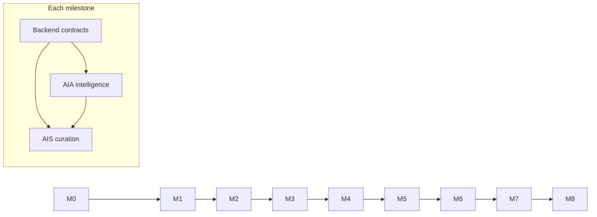

# TRELLIS — Engineering Milestones

**Source of truth chain:** `docs/problem.md` → `docs/prd.md` → `docs/techstack.md` → this file → `docs/guidelines.md`  
Version 1.0 · Status: locked for parallel build  
Audience: **AIA**, **AIS**, **Backend** (UI/UX works separately and does not depend on this doc)  
**Branching & agent workflow:** follow `docs/guidelines.md` (authoritative).

---

## 0. How to Use This Document

### Roles

| Role | Owns | Does not own |
|---|---|---|
| **AIA** — AI Identity Architecture | Declared/Revealed twin logic, interview extraction, Gap/Alignment math interfaces, bottleneck diagnosis, Identity Evolution Agent, Identity Agent node, Decision Engine identity packets | Live web retrieval, Identity Stack assembly UI contracts beyond schemas, FastAPI routers/DB migrations |
| **AIS** — AI Systems / Curation | LangGraph coordinator shell (shared with AIA on contracts), Knowledge/Opportunity/Planner/Reflection agent nodes, Recommendation Engine, Tavily/search adapter usage via provider, Identity Stack assembly + explanations, lens-weight adaptation signals | Gap arithmetic implementation, Postgres schema ownership, auth |
| **Backend** | FastAPI app, Postgres/Redis (MVP), repositories, evidence ingest API, dashboard/stack/ledger REST + WS contracts, seed script, Celery jobs wiring, provider stubs DI, Clerk JWT verification | Prompt design, agent reasoning quality, frontend screens |

UI/UX owns all Next.js screens, Moment Detector JS, Capacity Slider local swaps, feed morph, lattice visuals. Backend exposes contracts; AI roles produce structured payloads those screens consume.

### Merge model (CI/CD)

Work proceeds in **numbered milestones (M0–M8)**. Within each milestone:

1. Each role works on feature branches `m0`, `m1`, … cut from their role branch (`aia` / `ais` / `backend`), which themselves track `dev` — see `docs/guidelines.md` § branching.
2. A milestone is **merge-ready** only when **all three Merge Gates** for that M pass (see each section).
3. Merge order into `dev`: **Backend first** (contracts + schema), then **AIA**, then **AIS** — unless the milestone notes a different order.
4. Do not start M{N+1} agent runs until M{N} is merged to the role branch (or explicitly waived with a labeled stub).

### Shared non-negotiables (every milestone)

- Evidence never bypasses the unified `EvidenceEvent` path.
- Gap / Alignment / Create:Consume / failure thresholds / capacity tiers / Moment Detector rules are **deterministic** — LLMs never invent these numbers.
- All LLM/search/embedding calls go through `providers/` adapters only.
- Simulated data always carries `simulated: true` and honesty badges in API responses.
- Structured JSON outputs only; schemas live in Backend Pydantic and are mirrored in AI prompt schemas.

### Priority legend

Aligned with PRD: **P0** must ship · **P1** should ship · **P2** if time remains.

---

## 1. Role Boundaries (module map)

```text
services/api/app/
  schemas/          → Backend owns; AIA/AIS consume, propose changes via PR
  repositories/     → Backend
  services/         → Backend orchestration; AIA/AIS may add pure modules under services/identity, services/decision, services/recommendation
  agents/
    graphs/         → AIS owns Coordinator graph wiring
    nodes/
      identity/     → AIA
      evidence/     → AIA (enrichment) + Backend (ingest validation)
      knowledge/    → AIS
      opportunity/  → AIS
      planner/      → AIS
      reflection/   → AIS
      coach/        → AIS (P2)
      coordinator/  → AIS (calls Decision Engine owned by AIA)
  providers/        → Backend scaffolds; AIS fills search; AIA+AIS fill LLM usage patterns
  integrations/mcp/ → Backend adapters + seed fixtures; AIA ensures normalize → EvidenceEvent
  prompts/          → AIA (identity/bottleneck/evolution); AIS (curation/explain/reflect)
```

### Contract ownership

| Contract | Owner | Consumers |
|---|---|---|
| `EvidenceEvent` schema | Backend | AIA, AIS, UI |
| Declared Self / Twin version JSON | AIA defines shape; Backend persists | UI, AIS |
| Gap breakdown DTO | AIA formula; Backend endpoint | UI |
| Bottleneck packet | AIA | AIS Curator |
| Decision packet | AIA Growth Decision Engine | AIS Coordinator |
| Identity Stack DTO + explanations | AIS; Backend persists/serves | UI, Guardian |
| Trust Ledger entry + lens weights | AIS reflection rules + Backend store | UI, AIS ranking |
| Intervention variants `full/light/micro` | AIS generates; Backend caches | UI Guardian slider |

---

## 2. Milestone Overview

| Milestone | Theme | PRD features | Merge theme |
|---|---|---|---|
| **M0** | Scaffold + contracts | Infra | Empty app boots; shared schemas frozen |
| **M1** | Evidence + Twin foundation | F1 (partial), F2 | Events in → twin/gap out |
| **M2** | Gap math + dashboard API | F3 | Score moves on every event |
| **M3** | Onboarding interview agent | F1 | Aspiration → confirmed Declared Self |
| **M4** | Curation core (Next Step + Bottleneck) | F5 P0 | Real retrieval + stack + explanations |
| **M5** | Guardian + Trust Ledger P0 | F6, F7 P0 | Dismiss → unlearn → alternate stack |
| **M6** | Full stack catalogs + Ledger P1 | F5A–C, F7 P1 | Stories/tools/mentors + history |
| **M7** | Weekly Report + Identity Evolution | F8, F11 | Narrative + confirmable proposal |
| **M8** | Polish, P2, demo hardening | F9, F10, cut-rule survivors | Rehearsal-ready |

Demo script beats map to: M3 (Mirror), M4+M5 (Catch/Rejection), M5 (Protection), M5–M6 (Proof).

---

## M0 — Scaffold & Frozen Contracts

**Goal:** Repo, environments, and typed boundaries exist so the three roles can work without stepping on each other.

### Backend
- [ ] FastAPI app skeleton: `/healthz`, `/readyz`, config, DI container
- [ ] Postgres + Alembic bootstrap; Redis optional stub
- [ ] Pydantic v1 of: `EvidenceEvent`, `DeclaredSelf`, `GapBreakdown`, `BottleneckPacket`, `DecisionPacket`, `IdentityStack`, `LedgerEntry`, `InterventionVariant`
- [ ] Clerk JWT dependency stub (accept demo token / bypass flag for local)
- [ ] Folder layout matching `techstack.md` §24
- [ ] Seed script entrypoint (empty runners OK)
- [ ] GitHub Actions: lint + pytest smoke

### AIA
- [ ] Pure Python package layout for `services/decision/` and `services/identity/scoring/` (no LLM yet)
- [ ] Document Gap formula constants file (weights, λ, event subtype weights) matching PRD §9
- [ ] JSON Schema / TypedDict for Declared Self extraction target (prompt-ready)
- [ ] Unit tests: formula edge cases with fixture numbers (even if wired later)

### AIS
- [ ] LangGraph empty graph stub: nodes registered, checkpoint config
- [ ] `SearchProvider` / `LLMProvider` interface stubs consuming Backend provider facades
- [ ] Identity Stack assembly function signature + explanation field contract tests (fixture-based)
- [ ] Prompt folder skeleton: `curator_*`, `reflect_*`

### Merge Gates (M0)
1. `docker compose` (or local) brings API up; health checks green.
2. Schema package imports cleanly in AIA and AIS test suites.
3. No feature imports Gemini/Tavily SDKs outside `providers/`.

**Merge order:** Backend → AIA → AIS.

---

## M1 — Evidence Pipeline + Twin Shell

**Goal:** One ingest path; Revealed Self aggregates update; simulated history can load.

**PRD:** F2 (P0), MCP adapter boundary, seed history start.

### Backend
- [ ] `POST /api/v1/evidence` idempotent ingest (hash/dedupe)
- [ ] `GET /api/v1/evidence` windowed list
- [ ] Persist EvidenceEvents; emit internal `evidence.created`
- [ ] MCP adapter interface + at least one fixture adapter (e.g. github/youtube simulated)
- [ ] Simulator inject endpoint (dev-only): doomscroll burst, time advance
- [ ] Seed: 21-day Aarav simulated history, labeled `simulated: true`
- [ ] User + capacity row for demo profile

### AIA
- [ ] Evidence enrichment: map event → `identityAttributeIds` / `a_ik` suggestions (rule-based MVP OK)
- [ ] Revealed Self aggregate builder from event window (inputs to Gap, not Gap itself yet if unfinished)
- [ ] Twin read model: active Declared Self version + revealed aggregates structure
- [ ] Reject scoring on invalid/dead-letter events (contract with Backend)

### AIS
- [ ] Subscribe/hook pattern: on `evidence.created`, Coordinator may no-op but must accept DecisionPacket placeholder
- [ ] Do not rank resources yet; fixture “stack invalidation flag” only
- [ ] Ensure Reflection/Ledger modules can receive evidence IDs for later outcome windows

### Merge Gates (M1)
1. Seed load produces ≥ N events; all marked simulated where appropriate.
2. Live `POST /evidence` appears in GET within pipeline SLA (target &lt;2s including recompute hook).
3. Simulator inject uses same adapters — no pre-scored Gap fields inserted.
4. AIA aggregate tests pass on seeded Aarav fixture.

**Merge order:** Backend → AIA → AIS.

**UI handoff:** evidence list + simulator API ready for feed/dashboard wiring.

---

## M2 — Deterministic Gap, KPIs, Dashboard API

**Goal:** Identity Gap moves on every event; arithmetic fully explainable via API.

**PRD:** F3 (P0).

### Backend
- [ ] Persist KPI snapshots: Gap, Alignment, Create:Consume, Consistency, Momentum
- [ ] `GET /api/v1/dashboard/summary` — twin, KPIs, breakdown, bottleneck placeholder
- [ ] `GET /api/v1/identity` — versioned Declared Self
- [ ] WebSocket or 2s poll payload for Gap updates (techstack WS preferred; poll OK for MVP)
- [ ] Lattice strut → contributing events query (timestamp, weight, decayed contribution)

### AIA
- [ ] **Implement Gap formula** exactly per PRD §9 (pure functions, no LLM)
- [ ] Create:Consume ratio + Consistency + Momentum
- [ ] Gap breakdown object: per-attribute `w_i`, `D_i`, `R_i`, deficit, contributions by class
- [ ] Recompute on every accepted evidence event (called from Backend service)
- [ ] Bottleneck packet v0: rule/heuristic candidate list if LLM not ready; schema stable for AIS
- [ ] Tests: seeded history yields stable Gap; inject creation event lowers Gap; drift raises Gap

### AIS
- [ ] Growth Decision Engine consumer: read Gap/KPI deltas → set `invalidate` flags on active stack (even if stack empty)
- [ ] DecisionPacket population from AIA outputs
- [ ] No empty-stack crash when dashboard loads

### Merge Gates (M2)
1. Dashboard summary returns full arithmetic fields required by F3 popover.
2. Injecting a mission_completed event changes Gap without LLM calls.
3. AIA unit tests lock formula constants; Backend only hosts results.
4. DecisionPacket includes gap delta + invalidate flags for AIS.

**Merge order:** AIA (formula lib) → Backend (wire + API) → AIS (decision consumer).

**UI handoff:** lattice + Gap popover can bind purely to `dashboard/summary`.

---

## M3 — Mirror Interview (Identity Agent)

**Goal:** Conversational onboarding extracts confirmable Declared Self.

**PRD:** F1 (P0).

### Backend
- [ ] `POST /api/v1/identity/onboarding` — start/continue interview turn
- [ ] Persist transcript turns; on confirm, write Twin v1 (immutable versions)
- [ ] `PATCH /api/v1/identity` — user edits attributes/weights before confirm
- [ ] Enforce ∑ weights = 1 on confirm
- [ ] LLMProvider DI wired (Gemini primary, Bedrock failover stub)

### AIA
- [ ] Identity Agent node: 4–6 question policy; structured JSON extraction
- [ ] Prompts for aspiration → attributes → markers → weights
- [ ] Validation of extraction schema; repair pass if malformed
- [ ] Consent/confirm payload: “Did I get you right?”
- [ ] After confirm: Declared Self becomes Gap inputs (`D_i`, `w_i`)
- [ ] Latency target: sensible graph in &lt;20s for demo aspiration

### AIS
- [ ] On onboarding confirm trigger: Coordinator schedules first DecisionPacket + optional warm cache job (no user-facing stack required yet)
- [ ] Do not block onboarding on retrieval failures

### Merge Gates (M3)
1. End-to-end: chat turns → extract → edit/confirm → Twin v1 → Gap recomputes against seed evidence.
2. LLM only via provider adapter; structured output schema shared.
3. Unconfirmed extraction never overwrites active Declared Self.

**Merge order:** Backend (endpoints + provider) → AIA (agent) → AIS (post-confirm hook).

**UI handoff:** onboarding chat + confirmation card.

---

## M4 — Curation Core (Bottleneck + Next Step + Stack)

**Goal:** Continuous curation P0 path: diagnose bottleneck, retrieve real media, assemble Identity Stack with explanations.

**PRD:** F5 P0 (Next Step + Missing Action), Continuous Curation Engine.

### Backend
- [ ] Resource cache table; seeded fallback resources
- [ ] `GET /api/v1/stack/active`, `POST /api/v1/stack/refresh`
- [ ] Persist interventions/hypotheses shell (verdict pending)
- [ ] Celery (or background task): Tier-2 curation job
- [ ] SearchProvider adapter: cache → Tavily (1.5s timeout) → seeded fallback
- [ ] Source badges on every resource: Live web / Cached web / Curated fallback
- [ ] Prepared intervention storage for trigger path (at least one cached stack)

### AIA
- [ ] Bottleneck diagnosis via Gemini structured output over evidence aggregates + taxonomy (PRD §9)
- [ ] Packet: `{ bottleneck, confidence, supporting_evidence[], missing_evidence[], alternative_bottleneck }`
- [ ] Low confidence → flag “small experiment” for AIS
- [ ] Growth Decision Engine: what changed, which deficits, whether to re-run curation
- [ ] Never let bottleneck LLM rewrite Gap numbers

### AIS
- [ ] Coordinator graph: Decision → diagnose (AIA packet) → retrieve → assemble → (Guardian stub pass-through)
- [ ] Knowledge Agent: Next Step lens with live retrieval
- [ ] Planner Agent: micro-mission targeting bottleneck
- [ ] Identity Stack assembler: smallest coherent combination (not forced 8 slots)
- [ ] Mandatory explanations per element: Why this? Why now? How reduces Gap / increases Alignment?
- [ ] Replacement policy: keep valid elements; replace stale/failed/mismatched
- [ ] Guarantee: never return empty intervention (fallback catalog)

### Merge Gates (M4)
1. Refresh produces stack with ≥1 action + ≥1 resource; explanations present.
2. At least one demo path shows **Live web** or **Cached web** badge (real pipeline exercised).
3. Bottleneck visible in dashboard summary.
4. Retrieval failure still yields seeded stack; feed morph never blocked.

**Merge order:** Backend (cache/search/stack API) → AIA (bottleneck + decision) → AIS (graph + assembly).

**UI handoff:** Identity Stack cards + bottleneck chip; feed can show prepared intervention.

---

## M5 — Guardian Gate + Trust Ledger P0 (Demo Peak)

**Goal:** Capacity protection + dismiss → fail → System Unlearning → alternate lens. Stage beats 2–3.

**PRD:** F6 (P0), F7 P0.

### Backend
- [ ] Capacity as evidence/context event; store 0–100
- [ ] Intervention budget fields: interventions-today, last intervention time, dismissal rate
- [ ] Ledger APIs: list, record deliver/accept/snooze/dismiss/complete
- [ ] Persist lens weights; expose on decision/stack refresh
- [ ] Pre-store three variants per active intervention: `full` / `light` / `micro`
- [ ] Seed ledger: ~demo hypothesis with **two prior dismissals** so third live dismiss trips failure
- [ ] WS/poll updates for ledger verdicts &lt;250ms path for dismiss logging

### AIA
- [ ] Capacity tier mapping constants aligned with PRD (`67–100 full`, `34–66 light`, `0–33 micro`) — shared config
- [ ] Decision Engine: incorporate dismissal rate + budget into “whether to curate / intensity”
- [ ] Guardian reason codes (structured) for cancel/delay/downgrade — LLM may phrase copy later, rules decide
- [ ] On evidence from completions: recompute Gap (already M2) so demo score movement is guaranteed

### AIS
- [ ] Guardian node/gate before delivery: cap 5/day, spacing, capacity, dismissal rate
- [ ] Downgrade/delay/cancel with plain-language reason field
- [ ] Generate/cache `full`/`light`/`micro` variants for active stack (same hypothesis ID)
- [ ] Reflection P0: 3 dismissals in 14 days → hypothesis family `failed`; Media lens weight −40%; request alternate prepared lens
- [ ] System Unlearning tags on ledger entries
- [ ] Alternate stack ready without blocking on new LLM when possible (prepared cache)

### Merge Gates (M5)
1. Third dismissal flips Failed + Unlearning in &lt;250ms API/UI contract.
2. Subsequent refresh avoids rejected primary lens.
3. Variants share hypothesis ID; capacity change does not require LLM.
4. Completing alternate micro-mission lowers Gap on seeded persona.

**Merge order:** Backend (ledger + variants storage) → AIS (guardian + reflection rules) → AIA (decision budget integration).  
*Note:* AIS may merge before AIA if Decision Engine already exposes extension points from M2/M4.

**UI handoff:** Capacity Slider local swap; Ledger Failed/Unlearning states; feed dismiss path.

---

## M6 — Catalog Lenses + Full Ledger (P1)

**Goal:** Growth Stories, Tools, Mentors in stack; full ledger history.

**PRD:** F5A, F5B, F5C, F7 P1.

### Backend
- [ ] Seed 8–12 Growth Stories, 10–15 tools, 5–8 mentors (tagged: identity, stage, bottleneck, outcome)
- [ ] Catalog read APIs or embed in recommendation repo
- [ ] Full ledger history endpoint with worked/failed/pending + adaptations
- [ ] Optional Qdrant stub: if not ready, Postgres keyword/tag match acceptable for MVP

### AIA
- [ ] Enrich DecisionPacket with stage + bottleneck features for catalog ranking
- [ ] Optional identity summary embedding trigger (if EmbeddingProvider live)

### AIS
- [ ] Rank stories/tools/mentors by stage/bottleneck match — not popularity
- [ ] Include in stack only when justified by bottleneck (no filler)
- [ ] Explanations cite shared bottleneck/journey
- [ ] Opportunity Agent P1: events via search + Pune fallback list
- [ ] Ledger P1: success paths + pending outcome windows

### Merge Gates (M6)
1. At least one demo stack includes a seeded story or tool or mentor with match explanation.
2. Ledger shows seeded history + live demo chain.
3. Catalog items never appear without bottleneck justification.

**Merge order:** Backend (seeds + APIs) → AIS → AIA (packet fields if needed).

---

## M7 — Weekly Report + Identity Evolution

**Goal:** Narrative becoming report; confirmable identity update proposal.

**PRD:** F8 (P1), F11 (P1).

### Backend
- [ ] `POST /api/v1/agents/runs` type=weekly_report / evolution
- [ ] `POST /api/v1/identity/evolution/{id}/accept` and explicit reject/keep
- [ ] Versioned Declared Self on accept only; Gap uses new version after accept
- [ ] Reject leaves data unchanged

### AIA
- [ ] Weekly Report generation: identity movement narrative from evidence (not hours)
- [ ] Identity Evolution Agent: propose add/remove/reweight with cited evidence
- [ ] On-demand from report (no cron required)
- [ ] Never auto-apply Declared Self changes

### AIS
- [ ] Coordinator branch for report/evolution runs
- [ ] After accepted evolution: invalidate stack assumptions; trigger re-curation job

### Merge Gates (M7)
1. Report generates in &lt;10s from live DB state.
2. Accept → Twin vN; Reject → no mutation.
3. Post-accept curation refresh uses new Declared Self.

**Merge order:** Backend → AIA → AIS.

**UI handoff:** report card + Accept update / Keep current identity equally prominent.

---

## M8 — Demo Hardening & P2 (Optional)

**Goal:** Rehearsal stability; P2 only if P0/P1 core stable.

**PRD:** F9, F10, cut rule; Risks §14.

### Backend
- [ ] Seed calendar leverage events; plan-view API
- [ ] Partner match mock profiles endpoint (labeled prototype)
- [ ] Pre-warm caches for demo script path
- [ ] Bedrock failover tested once
- [ ] Observability basics: structured logs, LangSmith optional

### AIA
- [ ] Leverage-moment decision features from calendar proximity
- [ ] Tune seed targets so Gap movement is projector-legible
- [ ] Outside Voice lens (P2) constrained to 5 domains — only if time

### AIS
- [ ] Pre-generate prepared interventions for doomscroll demo path
- [ ] Growth Partner Match card (embedding similarity over fakes) — P2
- [ ] Execution Coach silenced unless Guardian allows — P2
- [ ] Full continuous loop dry-run: observe → … → measure against demo script

### Merge Gates (M8)
1. Demo script beats 1–4 runnable without empty states.
2. Cut rule respected: if unstable, drop P2 and nonessential P1 UI-facing extras; keep F7 P0 unlearning.
3. Honesty badges correct on all simulated surfaces.

**Merge order:** any order if gates green; prefer Backend seeds → AIA tuning → AIS prewarm.

---

## 3. Cross-Role Dependency Graph



| If blocked… | Do this |
|---|---|
| Gemini quota | AIS/AIA use fixtures + Bedrock; Backend keeps provider rotation |
| Tavily down | AIS serves curated fallback; badge must say so |
| Neo4j/Qdrant not up | Postgres tag match; do not block M4–M6 |
| UI not ready | Roles still merge on API contract tests + Postman/pytest |

---

## 4. Definition of Done (per milestone PR)

A milestone merge PR is complete when:

1. **Schemas** unchanged or version-bumped with both other roles notified.
2. **Tests:** role-owned unit tests + one cross-role integration test listed in the milestone gates.
3. **PRD acceptance** for listed features checked or explicitly deferred with cut-rule note.
4. **Honesty:** simulated/live badges correct in API payloads.
5. **No vendor leaks:** no direct Gemini/Tavily imports in `agents/` or `services/` business modules.
6. **Agent notes:** prompt versions recorded under `prompts/` with milestone tag.

---

## 5. Branch & PR Naming

Authoritative branching lives in `docs/guidelines.md`:

```text
dev
├── backend   → feature branches m0, m1, m2, …
├── aia       → feature branches m0, m1, m2, …
└── ais       → feature branches m0, m1, m2, …
```

PR title: `[M{N}][{ROLE}] short imperative summary`  
PR body must list Merge Gates checklist.

---

## 6. Cut Rule (Hour ~15 equivalent)

If behind:

| Keep | Drop / defer |
|---|---|
| M0–M5 P0 paths | M6 catalog richness (keep 1 story OR 1 tool minimum if possible) |
| F7 P0 dismiss → unlearn | F7 full history polish |
| F5 Next Step + Missing Action | F5 Outside Voice, F9, F10 |
| Gap popover fields | Weekly Report / Evolution (M7) |

AIA priority when cutting: Gap math + bottleneck packet.  
AIS priority when cutting: prepared stack + unlearning alternate.  
Backend priority when cutting: evidence + dashboard + ledger dismiss path.

---

## 7. Agent Coding Prompt Anchor

**Entrypoint:** `docs/guidelines.md` (agents load problem/prd/techstack/milestones from there).

```text
Read docs/guidelines.md and follow it.
Role: {aia|ais|backend}
Milestone: M{N}
Produce the implementation plan and open questions only.
```

---

## 8. Quick Responsibility Cheat Sheet

| Concern | AIA | AIS | Backend |
|---|---|---|---|
| Evidence schema & HTTP | | | ✓ |
| MCP normalize adapters | review | | ✓ |
| Gap / Alignment math | ✓ | | wire |
| Interview / Declared Self | ✓ | | persist |
| Bottleneck diagnosis | ✓ | consume | serve |
| DecisionPacket | ✓ | consume | | 
| LangGraph Coordinator | | ✓ | run infra |
| Tavily / stack assembly | | ✓ | cache/API |
| Guardian / variants | rules collab | ✓ | store |
| Trust Ledger unlearning | | ✓ | store/API |
| Weekly report / evolution | ✓ | trigger refresh | API/versions |
| Seed data | fixtures review | catalog tags | ✓ |
| Clerk / deploy | | | ✓ |

---

*End of milestones document. Next: `docs/guidelines.md` for agent + human coding conventions.*
