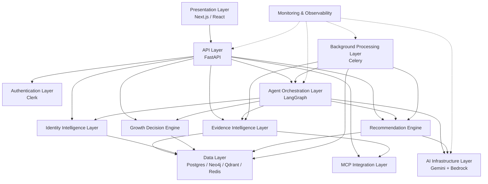
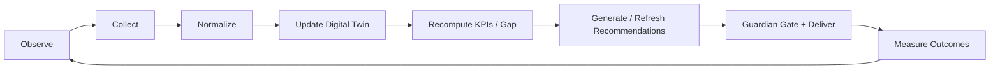

# TRELLIS — Technical Architecture & Technology Stack

**Software Design Document (Architecture)**  
Version 1.0 · Source of product truth: `docs/prd.md`  
Status: Implementation-ready

---

## 1. Purpose of This Document

This document defines the engineering architecture for Trellis: an **agentic AI curator** that continuously understands an individual's evolving identity (Declared Self vs Revealed Self), diagnoses the bottleneck holding them back, and curates the highest-impact combination of knowledge, media, opportunities, people, and actions to maximize human potential—not attention.

It is not a rewrite of the PRD. It translates the product vision into:

- layered system architecture
- technology choices with rationale
- module boundaries and communication contracts
- data flows and end-to-end operating loops
- folder structure and engineering principles

Every major subsystem is modular and independently replaceable. Application code depends on interfaces, not vendors.

---

## 2. System Architecture

Trellis is organized as a **layered architecture**. Layers communicate through typed contracts (REST/WebSocket APIs, event schemas, repository interfaces, and provider abstractions). Lower layers never import upper-layer UI concerns. Upper layers never reach into vendor SDKs directly.



### 2.1 Presentation Layer

| Aspect | Detail |
|---|---|
| **Purpose** | Deliver the Mirror Interview, Dashboard (lattice + Gap), Growth Feed, Trust Ledger, Weekly Report, Capacity Slider, and simulator panel. |
| **Responsibilities** | Render identity state; run Tier-0 deterministic Moment Detector locally (`<50ms`); morph interventions; optimistic UI; never invent Gap scores. |
| **Technologies** | Next.js, React, TypeScript, TailwindCSS, shadcn/ui, Framer Motion, React Query, React Hook Form, Zod |
| **Inputs** | User gestures, scroll telemetry, capacity slider, Clerk session |
| **Outputs** | Evidence events, onboarding answers, dismiss/snooze/complete actions |
| **Communication** | HTTPS REST to FastAPI; WebSocket for live Gap/stack updates; React Query for cache |
| **Scalability** | Edge-deployable; Moment Detector stays client-side so feed morph never depends on network |

### 2.2 API Layer

| Aspect | Detail |
|---|---|
| **Purpose** | Single system-of-record gateway for identity, evidence, recommendations, agents, and integrations. |
| **Responsibilities** | Validate requests; enforce auth; orchestrate services; emit domain events; return typed responses. |
| **Technologies** | FastAPI, Python 3.12, Pydantic, Uvicorn, REST + WebSockets |
| **Inputs** | Authenticated HTTP/WS payloads |
| **Outputs** | JSON DTOs, streaming agent updates, error envelopes |
| **Communication** | Calls services via DI; never talks to Gemini/Neo4j/Qdrant SDKs outside repositories/providers |
| **Scalability** | Stateless processes behind a load balancer; horizontal scale without sticky sessions |

### 2.3 Authentication Layer

| Aspect | Detail |
|---|---|
| **Purpose** | Establish who the user is before any identity or evidence mutation. |
| **Responsibilities** | OAuth/social login, JWT verification, session lifecycle, account linking, route protection. |
| **Technologies** | Clerk (frontend SDK + backend JWT verification) |
| **Inputs** | Login intents, Bearer tokens |
| **Outputs** | Verified `user_id`, session claims |
| **Communication** | Frontend obtains session; API verifies JWT on every protected route |
| **Scalability** | Stateless JWT verification; Clerk handles identity provider scaling |

### 2.4 Agent Orchestration Layer

| Aspect | Detail |
|---|---|
| **Purpose** | Run the continuous curation loop as a graph of agents with durable state. |
| **Responsibilities** | Coordinate Identity, Evidence, Knowledge, Opportunity, Reflection, Planner, Execution Coach, and Coordinator agents; persist graph state; retries and branching. |
| **Technologies** | LangGraph, Redis/Postgres checkpointers |
| **Inputs** | Evidence change events, capacity changes, calendar triggers, onboarding completion |
| **Outputs** | Identity Stack candidates, explanations, ledger hypotheses, evolution proposals |
| **Communication** | Invokes Growth Decision Engine (deterministic) before LLM nodes; uses AI Infrastructure for structured generation |
| **Scalability** | Graph runs are idempotent by `run_id`; workers can resume from checkpoint |

### 2.5 Identity Intelligence Layer

| Aspect | Detail |
|---|---|
| **Purpose** | Maintain Declared Self, Revealed Self, Gap/Alignment scores, bottleneck diagnosis inputs, and versioned identity history. |
| **Responsibilities** | Structured interview extraction; attribute/marker model; confidence; evolution proposals (never auto-apply). |
| **Technologies** | FastAPI services, Postgres, Neo4j identity graph, deterministic scoring module |
| **Inputs** | Onboarding transcript, evidence aggregates |
| **Outputs** | Versioned Digital Twin, Gap breakdown, bottleneck evidence pack |
| **Communication** | Reads Evidence store; writes Twin versions; feeds Growth Decision Engine |
| **Scalability** | Scoring is pure functions over aggregates—CPU-cheap and cacheable |

### 2.6 Evidence Intelligence Layer

| Aspect | Detail |
|---|---|
| **Purpose** | Normalize all behavioral signals into one schema before any scoring or agent sees them. |
| **Responsibilities** | Ingest, normalize, dedupe, confidence score, enrich identity tags, persist, emit “evidence.created”. |
| **Technologies** | Pydantic event models, Celery ingest tasks, Postgres + Redis dedupe keys |
| **Inputs** | App events, MCP payloads, simulator fixtures |
| **Outputs** | Canonical `EvidenceEvent` records |
| **Communication** | MCP adapters → Evidence pipeline → Identity + Decision engines |
| **Scalability** | Partition by `user_id`; idempotent ingest via source event hash |

### 2.7 Growth Decision Engine

| Aspect | Detail |
|---|---|
| **Purpose** | Deterministically decide *what changed*, *which gap matters*, and *whether curation should re-run* before any LLM call. |
| **Responsibilities** | Identity gap detection, Growth Vector computation, opportunity scoring inputs, prioritization, lens-weight updates from Trust Ledger. |
| **Technologies** | Pure Python decision modules, config constants for weights |
| **Inputs** | Twin state, evidence window, capacity, ledger outcomes |
| **Outputs** | Decision packet: bottleneck candidates, invalidate flags, ranking features |
| **Communication** | Called by Coordinator before Curator/LLM nodes |
| **Scalability** | No model I/O; safe to run on every event |

**Why deterministic first:** Gap arithmetic, failure thresholds, capacity tiers, and Moment Detector rules must be explainable and stage-reliable. LLMs interpret and explain; they do not invent the optimization target.

### 2.8 Recommendation Engine

| Aspect | Detail |
|---|---|
| **Purpose** | Assemble and continuously refresh the Identity Stack (media, knowledge, stories, tools, mentors, experiences, missions, reflection). |
| **Responsibilities** | Semantic/hybrid retrieval, catalog ranking, LLM rerank + explanation, filter by capacity/bottleneck/ledger. |
| **Technologies** | Qdrant, Tavily (retrieval adapter), Gemini/Bedrock for structured explanations |
| **Inputs** | Decision packet, twin, resource catalogs, cache |
| **Outputs** | Ranked Identity Stack with Why this / Why now / How it closes Gap |
| **Communication** | Reads Data Layer; writes interventions; Guardian gates delivery |
| **Scalability** | Cache-first candidates; async refresh; seeded fallback for empty/live failure |

### 2.9 MCP Integration Layer

| Aspect | Detail |
|---|---|
| **Purpose** | Bridge external tools into the Evidence schema without leaking provider fields into scoring. |
| **Responsibilities** | Connector lifecycle, OAuth/permissions, sync, normalize via `EvidenceAdapter`. |
| **Technologies** | MCP-compatible connectors, encrypted token store, Celery sync jobs |
| **Supported (design)** | GitHub, YouTube, Google Calendar, Google Drive, Notion, Cursor, VS Code; LinkedIn (future) |
| **Inputs** | Raw MCP payloads |
| **Outputs** | Normalized EvidenceEvents (`simulated` flag when fixtures) |
| **Communication** | Adapters only; Evidence Intelligence owns persistence |
| **Scalability** | Per-provider workers; backpressure via Redis queues |

### 2.10 Data Layer

| Aspect | Detail |
|---|---|
| **Purpose** | Persist relational truth, graph relationships, vectors, and hot cache separately. |
| **Technologies** | PostgreSQL, Neo4j, Qdrant, Redis |
| **Responsibilities** | ACID user/identity/evidence/ledger; graph traversals; semantic search; sessions/queues |
| **Communication** | Accessed only through repositories |
| **Scalability** | Each store scales independently; Postgres remains system of record for Gap inputs |

### 2.11 AI Infrastructure Layer

| Aspect | Detail |
|---|---|
| **Purpose** | Model-agnostic structured generation and embeddings behind one interface. |
| **Technologies** | Gemini (primary, multi-key rotation), Amazon Bedrock (fallback), embedding providers |
| **Responsibilities** | Key rotation, retries, cooldown, failover, structured JSON outputs |
| **Communication** | Agents call `LLMProvider.generate_structured()` only |
| **Scalability** | Add keys/providers without changing business logic |

### 2.12 Background Processing Layer

| Aspect | Detail |
|---|---|
| **Purpose** | Run Tier-2 work off the request path. |
| **Technologies** | Celery + Redis |
| **Jobs** | Evidence ingest, embedding creation, recommendation refresh, agent runs, periodic KPI recompute |
| **Communication** | Enqueued by API/events; writes results to Data Layer; notifies clients via WS/poll |
| **Scalability** | Autoscale workers by queue depth |

### 2.13 Monitoring & Observability Layer

| Aspect | Detail |
|---|---|
| **Purpose** | Make agent decisions, LLM latency, and API health inspectable. |
| **Technologies** | LangSmith, OpenTelemetry, Sentry, structured logs, metrics, health checks |
| **Communication** | Trace IDs propagate API → Celery → agents → LLM provider |
| **Scalability** | Sampling policies for high-volume evidence ingest |

---

## 3. End-to-End Operating Model

Trellis optimizes the **Identity Gap score** (0–100, lower better) and Alignment (`100 − Gap`). The Gap is never LLM-generated.



**Continuous Learning Loop**

1. **Observe** — app actions, scroll rules, MCP sync, simulator.
2. **Collect** — raw payloads enter adapters.
3. **Normalize** — unified EvidenceEvent schema.
4. **Update Digital Twin** — Revealed Self aggregates; Declared Self only via confirmed interview/evolution.
5. **Recompute KPIs** — Gap, Alignment, Create:Consume, Consistency, Momentum.
6. **Generate Recommendations** — Decision Engine features → retrieval → LLM explanation → Identity Stack.
7. **Repeat** — any material state change invalidates only affected assumptions.

Tiered latency (aligned with PRD):

- **Tier 0 (`<100ms`):** Moment Detector, Gap recompute, capacity swap, dismissal/ledger rules — no LLM.
- **Tier 1 (`<300ms`):** cache/prepared intervention.
- **Tier 2 (`1–10s`):** agent reasoning, live retrieval, weekly report, evolution proposals.

---

## 4. Frontend Stack

### 4.1 Technologies and Rationale

| Technology | Why it exists |
|---|---|
| **Next.js** | App Router for screens (onboarding, dashboard, feed, ledger, report); API proxy if needed; Vercel deploy path. |
| **React** | Component model for lattice, feed morph, capacity-driven card swaps. |
| **TypeScript** | Shared contracts with backend DTOs; prevents silent schema drift. |
| **TailwindCSS** | Fast, consistent layout without CSS sprawl during rapid iteration. |
| **shadcn/ui** | Accessible primitives (dialog, slider, tooltip for Gap arithmetic) without locking into a heavy design system. |
| **Framer Motion** | Feed-card morph (“The Catch”) and capacity downgrade transitions. |
| **React Query** | Server-state cache for twin, stack, ledger; background refresh; optimistic updates. |
| **React Hook Form** | Onboarding edits and confirmation forms. |
| **Zod** | Client-side schema validation mirroring Pydantic models. |

### 4.2 Component Architecture

- **Pages/routes:** `/onboarding`, `/dashboard`, `/feed`, `/ledger`, `/report`
- **Feature modules:** `identity/`, `feed/`, `guardian/`, `ledger/`, `simulator/`
- **Domain UI:** Lattice visualization, Gap popover (full arithmetic), Identity Stack cards, Capacity Slider
- **Local engines:** Moment Detector (deterministic JS rules), capacity-tier mapper (`full` / `light` / `micro`)
- **Shared:** design tokens, source badges (`Live web` / `Cached web` / `Curated fallback` / `simulated`)

### 4.3 API Communication

- REST for CRUD and agent triggers
- WebSocket channel `user:{user_id}` for Gap, stack, ledger verdicts
- React Query keys scoped by user + resource version
- Errors surfaced with stable `error_code` for UI copy

### 4.4 Authentication Flow (Clerk)

1. User signs in via Clerk (OAuth/email).
2. Frontend receives session; attaches JWT to API calls.
3. FastAPI validates JWT; maps Clerk `sub` → internal `user_id`.
4. Protected Next.js routes wrap authenticated layouts; unauthenticated users redirect to sign-in.
5. Account linking (multiple OAuth identities → one Trellis user) handled by Clerk; backend stores single user row.

### 4.5 Dashboard Rendering

Dashboard binds to:

- Declared/Revealed twin
- Gap + Alignment + breakdown
- Create:Consume, Consistency, Momentum
- Potential Bottleneck packet
- Active Identity Stack
- Capacity Slider (local swap of prepared variants; persists capacity as evidence)

Lattice struts map 1:1 to identity markers; click opens contributing evidence with decayed weights.

### 4.6 State Management

- **Server state:** React Query
- **UI/ephemeral:** React state + local event bus for Tier-0 feed/detector
- **No global Redux** for MVP; keep feed morph offline-capable relative to network

---

## 5. Backend Stack

### 5.1 Why FastAPI (not Node) for the production architecture

| Reason | Explanation |
|---|---|
| **AI/data ecosystem** | LangGraph, embeddings, Neo4j/Qdrant clients, scientific scoring, Celery are first-class in Python. |
| **Typed contracts** | Pydantic v2 aligns with structured LLM outputs and Evidence schemas. |
| **Async I/O** | Native async for DB, Redis, HTTP providers while keeping CPU-bound scoring in sync/worker paths. |
| **Replaceability** | Presentation stays Next.js; backend can evolve into microservices without rewriting agents. |

Hackathon note: PRD allows Next.js API routes for the 24h demo. This SDD specifies FastAPI as the durable backend shape; internal modules stay portable either way.

### 5.2 API Folder Structure (conceptual)

```text
backend/
  app/
    main.py
    api/                 # routers: auth, identity, evidence, recommendations, dashboard, agents, integrations
    core/                # config, security, logging, di
    models/              # SQLAlchemy + domain entities
    schemas/             # Pydantic DTOs
    repositories/        # data access
    services/            # business logic
    agents/              # LangGraph graphs + agent nodes
    providers/           # llm, embeddings, search
    integrations/        # MCP adapters
    workers/             # Celery tasks
    prompts/             # versioned prompt templates
```

### 5.3 Service Architecture & Repository Pattern

- **Routers** parse/validate and call services.
- **Services** own use-cases (ingest evidence, recompute gap, request curation).
- **Repositories** isolate Postgres/Neo4j/Qdrant/Redis.
- **Providers** isolate Gemini/Bedrock/Tavily/embeddings.

### 5.4 Dependency Injection

FastAPI `Depends()` wires:

- DB sessions
- current user
- repositories
- `LLMProvider`, `SearchProvider`, `EmbeddingProvider`

Tests swap fakes without patching globals.

### 5.5 Validation

- Request/response: Pydantic
- Evidence ingest: schema + category whitelist + weight constants
- Reject unknown provider fields before persistence

### 5.6 Async Architecture

- API handlers: async for I/O
- Deterministic scoring: sync pure functions (fast)
- LLM/retrieval/embeddings: Celery or background tasks so Tier-0 UX never waits

---

## 6. Authentication (Clerk)

### 6.1 JWT Flow

1. Clerk issues session JWT after login.
2. Client sends `Authorization: Bearer <jwt>`.
3. Backend verifies signature/issuer/audience via Clerk JWKS.
4. Claims yield stable external subject; upsert local user.

### 6.2 Protected Routes

- Middleware/dependency rejects missing/invalid JWT with 401.
- Resource authorization checks `user_id` ownership (least privilege).

### 6.3 Sessions

- Clerk manages browser session lifetime/refresh.
- Redis may cache verified session metadata for rate limiting, not as source of truth for identity.

### 6.4 OAuth & Account Linking

- Social providers configured in Clerk.
- Linking merges external identities under one Trellis user; evidence remains keyed by internal UUID.

---

## 7. Database Layer — PostgreSQL

**Purpose:** System of record for transactional state judges and formulas depend on.

**Stores:**

- Users, preferences, capacity
- Digital Twin versions (Declared Self)
- Identity attributes, markers, weights
- Growth KPIs snapshots
- Evidence events
- Recommendations / interventions / Identity Stacks
- Goals, projects, activities
- Trust Ledger hypotheses and verdicts
- Cached retrieval results
- Integration connection metadata (no raw secrets in plain columns)

**Responsibilities:** ACID writes for evidence → score → ledger chains.

**Technologies:** PostgreSQL, SQLAlchemy, Alembic migrations.

**Data flow:** API/services → repositories → Postgres; Gap inputs always readable without Neo4j/Qdrant.

**Communication:** Identity, Evidence, Recommendation, Agent services.

**Scalability:** Read replicas for dashboard; partition evidence by user/time later.

---

## 8. Graph Database — Neo4j

**Purpose:** Model relationships that ranking formulas alone do not express well.

**Used for:**

- Identity graph (attributes ↔ markers ↔ evidence)
- Skill / interest / knowledge graphs
- Connections among people, skills, goals, resources, mentors, stories

**Why graph traversal improves recommendations:**

- Bottleneck “execution” + skill “public speaking” + goal “ship talks” can traverse to mentors/stories that share that path, not just keyword overlap.
- Multi-hop paths surface structural analogies (Outside Voice) with explicit edge explanations.
- Evolution proposals cite connected evidence clusters rather than isolated events.

**Data flow:** Twin/evidence updates upsert nodes/edges asynchronously; Recommendation Engine queries paths as ranking features.

**Scalability:** Independent cluster; optional for MVP scoring if Postgres aggregates suffice—graph deepens matching quality post-MVP.

---

## 9. Vector Database — Qdrant

**Purpose:** Semantic memory and resource similarity.

**Stores:** embeddings for knowledge, resources, semantic memories, identity summary vectors.

**Search modes:**

| Mode | Use |
|---|---|
| **Semantic search** | Nearest neighbors for media/knowledge given twin + bottleneck query vector |
| **Similarity search** | Growth partner / mentor / story match |
| **Hybrid search** | Dense vectors + metadata filters (bottleneck, stage, identity tags, source) |
| **Metadata filtering** | Exclude failed hypothesis families; capacity-appropriate difficulty |

**Lifecycle:** create/update embedding on resource ingest or twin summary change → upsert Qdrant point → retrieve candidates → LLM rerank/explain.

---

## 10. Cache Layer — Redis

**Uses:**

- Session/rate-limit counters
- Temporary agent memories / prepared intervention cache
- Celery broker/result backend
- Fast recommendation/Gap snapshot caching
- Dedupe keys for evidence hashes

**Scalability:** Cluster mode; TTLs for stack candidates; never sole store for ledger/twin.

---

## 11. AI Infrastructure

### 11.1 Model-Agnostic Design

Application code calls:

```text
LLMProvider.generate_structured(schema, messages, opts) -> dict
EmbeddingProvider.embed(texts) -> list[vector]
SearchProvider.search(query, opts) -> list[Document]
```

No feature imports Gemini/Bedrock/Tavily SDKs outside `providers/`.

### 11.2 Primary: Google Gemini API + Key Rotation Layer

Multiple free-tier Gemini API keys sit behind a rotation facade.

| Mechanism | Behavior |
|---|---|
| **Round robin** | Select next healthy key |
| **Failure detection** | 429/5xx/timeouts mark soft failure |
| **Automatic retry** | Retry same request with next key |
| **Cooldown** | Unhealthy key enters cooldown window |
| **Rate limit handling** | Respect retry-after; shed Tier-2 load first |
| **Key health monitoring** | Success/error/latency metrics per key |
| **Quota exhaustion** | Mark exhausted until reset; failover |
| **Automatic failover** | Exhausted pool → Bedrock secondary |

Callers never know which key is active.

### 11.3 Fallback: Amazon Bedrock

If all Gemini keys fail, provider switches to Bedrock. Same `generate_structured()` contract.

**Vendor lock-in avoidance:** prompts, schemas, and agent graphs are provider-agnostic. Future pluggable providers: Claude, Llama, Nova, OpenAI—register adapter, set config, no business-logic rewrite.

### 11.4 Embeddings

- **BGE-large** and/or **Google Embeddings** via `EmbeddingProvider`
- Vectors stored in Qdrant with payload metadata
- Re-embed on resource update or identity summary version bump

---

## 12. Agent Framework — LangGraph

| Concern | Design |
|---|---|
| **Graph orchestration** | Nodes = agents/tools; edges = control flow (diagnose → retrieve → assemble → guard → reflect) |
| **State persistence** | Checkpoint twin version, decision packet, stack draft, run_id |
| **Retries** | Transient LLM/search errors retry with provider rotation; deterministic nodes do not retry spuriously |
| **Memory** | Short-term in graph state; long-term in Postgres/Qdrant; ledger outcomes as adaptation memory |
| **Branching** | Low bottleneck confidence → small experiment path; Guardian cancel → end without delivery |

---

## 13. Multi-Agent Architecture

Coordinator owns the graph. Specialized agents have narrow tools.

### 13.1 Coordinator Agent

| | |
|---|---|
| **Input** | Trigger event, twin snapshot, capacity, ledger weights |
| **Output** | Ordered run plan, final stack handoff |
| **Responsibilities** | Invoke Decision Engine first; fan-out/fan-in agents; enforce confirmation gates |
| **Memory** | Graph checkpoint |
| **Failure recovery** | Resume from last successful node; degrade to cached stack |

### 13.2 Identity Agent

| | |
|---|---|
| **Input** | Interview messages or evolution request + evidence trends |
| **Output** | Declared Self JSON / evolution proposal (pending confirmation) |
| **Responsibilities** | Attributes, markers, weights; never silent overwrite |
| **Communication** | Identity Intelligence + Postgres versions |
| **Failure recovery** | Return last confirmed twin; flag proposal failed |

### 13.3 Evidence Agent

| | |
|---|---|
| **Input** | Raw/normalized events |
| **Output** | Validated EvidenceEvent batch, enrichment tags |
| **Responsibilities** | Schema enforcement, category weights, identity attribute linkage suggestions |
| **Memory** | Recent event window |
| **Failure recovery** | Dead-letter invalid payloads; do not score garbage |

### 13.4 Knowledge Agent

| | |
|---|---|
| **Input** | Decision packet, twin |
| **Output** | Knowledge/media candidates with sources |
| **Responsibilities** | Hybrid retrieval + cache/fallback badges |
| **Failure recovery** | Seeded catalog; never empty stack |

### 13.5 Opportunity Agent

| | |
|---|---|
| **Input** | Location/time context, bottleneck, calendar |
| **Output** | Experiences/events/challenges |
| **Responsibilities** | Real-world opportunity lens |
| **Failure recovery** | Prefetched local list (labeled) |

### 13.6 Reflection Agent

| | |
|---|---|
| **Input** | Intervention hypothesis + outcome window evidence |
| **Output** | Verdict worked/failed/pending; lens weight updates (deterministic thresholds) |
| **Responsibilities** | Trust Ledger closure; System Unlearning signals |
| **Failure recovery** | Leave pending; do not invent success |

### 13.7 Planner Agent

| | |
|---|---|
| **Input** | Twin, bottleneck, capacity, leverage moments |
| **Output** | Micro-missions + sequencing |
| **Responsibilities** | Smallest coherent action set for Identity Stack |
| **Failure recovery** | Use prepared micro variant |

### 13.8 Execution Coach

| | |
|---|---|
| **Input** | Active mission, user progress events |
| **Output** | Coaching nudges within Guardian budget |
| **Responsibilities** | Keep user moving without spam |
| **Failure recovery** | Silence if Guardian cancels |

**PRD mapping:** Identity Modeler ↔ Identity Agent + Decision Engine scoring; Curator ↔ Knowledge + Opportunity + Planner; Guardian remains a deterministic gate with optional LLM phrasing; Moment Detector stays client deterministic JS.

---

## 14. MCP Integration Layer

### 14.1 Architecture

Each provider implements only `normalize(raw) -> EvidenceEvent`. Shared pipeline validates, dedupes, scores category weights, persists, recomputes Revealed Self.

### 14.2 Connector Lifecycle

1. User grants permissions (OAuth / MCP consent).
2. Tokens stored encrypted; scopes least-privilege.
3. Initial backfill sync (Celery).
4. Incremental sync / webhooks.
5. Revocation disables connector and stops ingest.

### 14.3 Sync, Extraction, Normalization

- Extract provider-native events (commits, watch, calendar, docs, Notion pages, editor activity).
- Map to unified schema; set `source`, `confidence`, capability/identity tags.
- Simulator uses same adapters with fixtures—never inserts pre-scored Gap fields.

### 14.4 Permissions

Per-integration scopes; UI honesty labels for simulated vs live; no DOM injection into third-party social apps.

---

## 15. Evidence Intelligence Layer

### 15.1 Unified Event Schema

```text
event_id
event_type
timestamp
source
confidence
capability_tags
identity_tags
importance
metadata
(+ PRD fields: user_id, category, value, baseWeight, simulated, identityAttributeIds)
```

### 15.2 Pipeline Stages

1. **Normalization** — adapter maps raw → schema  
2. **Deduplication** — provider event id / content hash  
3. **Confidence scoring** — source reliability × completeness  
4. **Identity enrichment** — attribute applicability `a_ik`  
5. **Storage** — Postgres (truth) + async graph/vector projections  
6. **Emit** — `evidence.created` for Decision Engine / agents  

No module consumes raw MCP payloads for scoring.

---

## 16. Identity Digital Twin

### 16.1 Model

- Aspirations / career goals  
- Skills, strengths, weaknesses  
- Values, habits, learning preferences  
- Declared attributes + observable markers + weights  
- Growth KPIs (Gap, Alignment, Create:Consume, Consistency, Momentum)  
- Evidence history references  
- Potential Bottleneck packet  

### 16.2 Update Pipeline

1. Onboarding confirmation → Twin v1  
2. Evidence → Revealed aggregates (continuous)  
3. Evolution Agent proposal → user Accept/Keep → Twin vN  
4. Every version immutable; Gap always uses active confirmed Declared Self  

### 16.3 Confidence & Evolution

- Attribute confidence from evidence density/recency  
- Historical evolution retained for Weekly Report narratives  
- Human authority preserved on all Declared Self changes  

---

## 17. Growth Decision Engine

| Function | Behavior |
|---|---|
| **Identity gap detection** | Deterministic formula from PRD §9 with 7-day half-life |
| **Opportunity scoring** | Features from calendar proximity, capacity, bottleneck |
| **Growth Vector** | Direction of largest weighted deficits + create/consume imbalance |
| **Recommendation prioritization** | Invalidate stale stack elements; keep still-valid ones |
| **Decision reasoning** | Structured packet for LLM explanation (facts first) |
| **Long-term optimization** | Ledger lens weights; prefer interventions that historically worked |

**Deterministic before LLM:** arithmetic, thresholds (e.g., 3 dismissals → failed family), capacity tiers, Moment Detector—all pure rules. LLM selects taxonomy labels, writes explanations, and ranks qualitative fit—never invents Gap.

---

## 18. Recommendation Engine

### 18.1 Pipeline

1. Semantic/hybrid retrieval (Qdrant + catalogs + Tavily adapter)  
2. Knowledge retrieval with cache → live → seeded fallback  
3. Feature ranking from Decision Engine  
4. LLM reranking + Why this / Why now / Gap impact  
5. Filtering: Guardian budget, capacity tier, failed lenses, safety  

### 18.2 Categories

Books, courses, hackathons, research papers, mentors, communities, videos, projects, open-source issues, challenges—plus PRD Identity Stack types: Growth Story, Tool, Real-World Experience, Micro Mission, Reflection.

Each delivered element carries explanations and source honesty badges.

---

## 19. API Design

REST prefix: `/api/v1`

| Area | Examples |
|---|---|
| **Authentication** | Session verification via Clerk; `/me` |
| **Identity** | `GET/PATCH /identity`, `POST /identity/onboarding`, `POST /identity/evolution/{id}/accept` |
| **Evidence** | `POST /evidence`, `GET /evidence`, simulator inject |
| **Recommendations** | `GET /stack/active`, `POST /stack/refresh` |
| **Dashboard** | `GET /dashboard/summary` (gap breakdown, KPIs, bottleneck) |
| **Agents** | `POST /agents/runs`, `GET /agents/runs/{id}` |
| **Integrations** | `GET/POST /integrations/{provider}/connect`, sync status |
| **Ledger** | `GET /ledger`, dismiss/complete endpoints |
| **WebSocket** | `/ws/updates` |

Conventions: JSON, Pydantic validation, idempotency keys on evidence POST, problem+json errors.

---

## 20. Background Processing

**Celery + Redis**

| Job | Trigger |
|---|---|
| Evidence ingestion / projection | New raw payload |
| Embedding creation | Resource or twin summary change |
| Recommendation generation | Decision invalidation |
| Agent execution | Curation triggers |
| Periodic jobs | KPI snapshots, connector sync, ledger outcome windows |

API returns quickly; workers publish completion events for UI refresh.

---

## 21. DevOps

| Piece | Role |
|---|---|
| **Docker** | Backend, workers, Postgres, Neo4j, Qdrant, Redis |
| **GitHub Actions** | Lint, typecheck, unit tests, image build, migrate |
| **Vercel** | Frontend |
| **Railway** | API + workers + datastores (or managed equivalents) |

**Environments:** `local` / `staging` / `production` via env configs; secrets never in repo.

**Deploy flow:** PR checks → merge → build images → migrate → deploy API/workers → deploy frontend → health checks.

---

## 22. Observability

| Tool | Use |
|---|---|
| **LangSmith** | Agent/LLM traces, prompt versions |
| **OpenTelemetry** | Distributed traces API → worker → DB → provider |
| **Sentry** | Exceptions |
| **Structured logging** | JSON logs with `trace_id`, `user_id`, `run_id` |
| **Metrics** | Gap recompute latency, LLM latency/token, queue depth, key health |
| **Health checks** | `/healthz` liveness; `/readyz` for DB/Redis |

Monitor agents for node duration and fallback rates; LLM latency separately from deterministic Tier-0 paths.

---

## 23. Security

- JWT verification on protected APIs  
- HTTPS everywhere  
- Secrets manager for API keys (Gemini pool isolated from app secrets surface)  
- Rate limiting (Redis)  
- Prompt injection protection: treat external content as untrusted; structured outputs only; no tool execution from raw user HTML  
- Input validation (Pydantic/Zod)  
- API key isolation inside provider layer  
- Least privilege DB roles and integration scopes  
- Permission-based MCP connectors; user-revocable  

---

## 24. Folder Structure

```text
hbtmpune/
  docs/
    prd.md
    techstack.md
  apps/
    web/                          # Next.js frontend
      app/
      components/
      features/
        identity/
        feed/
        guardian/
        ledger/
        simulator/
      lib/
        api/
        auth/
        moment-detector/
      hooks/
      styles/
  services/
    api/                          # FastAPI monolith (MVP)
      app/
        api/
        core/
        models/
        schemas/
        repositories/
        services/
        agents/
          graphs/
          nodes/                  # identity, evidence, knowledge, opportunity,
                                  # reflection, planner, coach, coordinator
        providers/
          llm/
          embeddings/
          search/
          key_rotation/
        integrations/
          mcp/
            github/
            youtube/
            calendar/
            drive/
            notion/
            cursor/
            vscode/
        workers/
        prompts/
        config/
  docker/
  .github/workflows/
```

---

## 25. Engineering Principles

1. **Modular architecture** — replace any layer behind interfaces  
2. **Model-agnostic AI** — business logic unaware of Gemini vs Bedrock  
3. **Provider abstraction** — LLM, search, embeddings, MCP  
4. **Dependency injection** — testable services  
5. **Repository pattern** — swappable datastores  
6. **Clean architecture** — domain rules (Gap, ledger) independent of frameworks  
7. **Microservice-ready monolith** — module boundaries match future service cuts  
8. **Event-driven evidence pipeline** — one schema, many sources  
9. **Stateless APIs** — scale horizontally; state in data stores  
10. **Deterministic core, agentic shell** — scores and triggers are rules; agents curate and explain  

---

## 26. Hackathon Optimization (24 Hours) vs Production Path

This architecture is intentionally dual-horizon:

| Hackathon (speed) | Production (scale) |
|---|---|
| Monolithic FastAPI (or PRD’s Next.js API routes) for MVP | Same internal modules extracted to services later |
| Modular internal packages | Split Evidence / Agents / Recommendations by queue boundaries |
| Single deployment for demo reliability | Docker + Railway/Vercel multi-service |
| Postgres primary; Neo4j/Qdrant may be stubbed or light | Full polyglot data responsibilities |
| Gemini free-tier **key rotation** to minimize cost | Same rotation + Bedrock only as fallback |
| Simulated MCP via adapters | Real OAuth/MCP connectors without schema changes |
| Seeded catalogs + one live Tavily/YouTube path | Broader live retrieval |
| Developer tooling (Cursor, Claude, Codex, Antigravity) for coding speed only | Not part of runtime architecture |

**Non-negotiables even in 24h:** unified EvidenceEvent path, deterministic Gap math, provider adapter for LLM/search, Guardian/capacity local path, honesty labels for simulated data.

---

## 27. Consistency Checklist with PRD Vision

- Optimizes **Identity Gap / human potential**, not engagement  
- Declared vs Revealed Self + continuous curation loop  
- Identity Stack multi-resource assembly with explanations  
- Trust Ledger + System Unlearning  
- Guardian capacity protection  
- Moment Detector deterministic and local  
- MCP-ready evidence bridge without building full OAuth in MVP  
- Gemini primary, Bedrock fallback, single adapter  

---

*End of Technical Architecture & Technology Stack document.*
